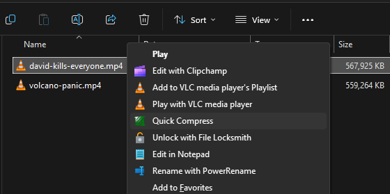
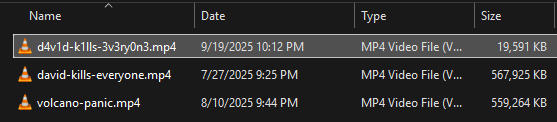

# Quick Convert

version 0.1
These damn discord clips are too big!!

## Prereqs 

[ffmpeg](https://ffmpeg.org/)

## Install

1. Clone this repo
2. Edit the .reg.template file to have the absolute paths to the script and icon, where necessary ("Icon"= and @=)
3. Rename the reg template to .reg
4. Double-click the new .reg file to install

## How to use

If everything installed correctly, Shift + right click on a .mp4 file. You should see an option called "Quick Compress".

This will spit out a new file with a l33t sp34k filename that's compressed to 1080 width. Check out that file size!

## Caveats

* The icon filename can't have dashes (-), use underscores (_)
* Remember to escape special characters in the .reg file. So, `\\` for `\`, `\"` for quotes, etc.

## Improvements

* Make an installer that does all the annoying filepath changes n shid
* Add sub-commands for different compression settings (currently hardcoded)
* Add configuration gui